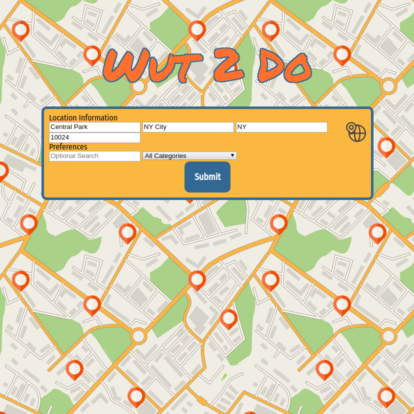
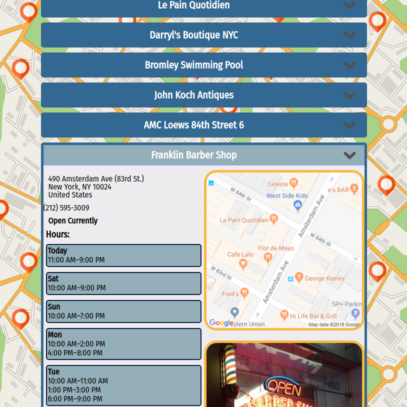

# Wut 2 Do
## -It's where you go when you don't know where to go-

You can visit a live version of this app here: [Wut 2 Do](https://escottalexander.github.io/wut2do/)

### How to use Wut 2 Do

The user fills out there location information or clicks on the geolocation icon in the top right corner and clicks submit.

Immediately several venues matching their location, search query and specific categories of interest appear. the user can then selcet them and see various information such as rating,descriptions, address, whether they are currently open or not, hours, website and a picture of the venue. A map also loads letting the user know where the venue is in relation to them.

### Technology used

Wut 2 Do was built using HTMl, CSS, and JavaScript with jQuery handling all of the UI as well as various API calls to the Google Reverse Geolocation API, Google Static Maps API, and several calls to the event and venue tracking APIs from Foursuare.